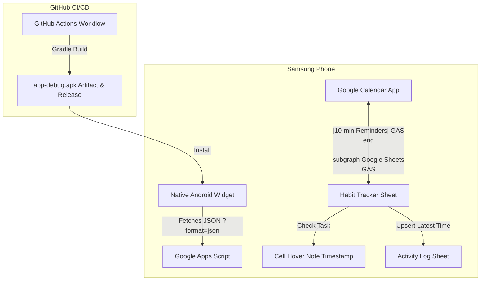

# 📋 Project Handover & Architecture Document

### 1. Project Overview & Repository
* **GitHub Repository:** [meeta13-byte/Task-Tracker](https://github.com/meeta13-byte/Task-Tracker)
* **Active Branch:** `main` (All changes merged via Pull Request #1)
* **User's Environment:**
  * **Phone:** Samsung Galaxy (Android / One UI)
  * **Desktop:** Mac (using Safari)
  * **Google Sheet:** [Task Tracker Google Sheet](https://docs.google.com/spreadsheets/d/1mViYNLdfI6GD93Og4KLQKN9YmXx3Gm8nXGuamfCPNuo/edit)

---

### 2. Core Daily Tasks
The system is built around tracking 3 specific daily goals:
1. `Gate (4 hours)` — Target alert: `10:00`
2. `Leetcode (2 que)` — Target alert: `18:00`
3. `Github commit (5)` — Target alert: `21:30`

*(Note: "Office" tasks are explicitly excluded from habit sync).*

---

### 3. Architecture & Components



---

### 4. What Has Been Completed So Far

#### A. Google Sheets & Apps Script (`Code.js` on `main`)
* **Horizontal Task Matrix:** Tasks in rows (2–4), next 30 days in columns (e.g., `29 Sep (Tue)`). Today's column is highlighted in blue with `📍`.
* **GitHub-Style Green Intensity Row:** Row 7 calculates completion percentage using discrete 4-tier GitHub colors (0% Gray `#ebedf0`, 33% Light Green `#9be9a8`, 67% Medium Green `#40c463`, 100% Deep Green `#216e39`).
* **Timestamp Upsert Engine (`onEdit`):**
  * When a box is checked, a hover note is attached with the timestamp (`✅ Done at: YYYY-MM-DD HH:MM:SS`).
  * If a user checks, unchecks, and re-checks a box, it **overwrites the existing row with the latest time only**—preventing duplicate rows in `Activity Log`.
  * If unchecked, the note is removed and the entry is cleared from the log.
* **Google Calendar Sync (`syncTodayToCalendar`):**
  * Automatically **deletes previous habit events for today before syncing** to prevent duplicate alerts.
  * **Filters out any "Office" tasks** so work items don't crowd habit reminders.
  * Sets 10-minute popup mobile reminders.
* **JSON API Endpoint (`doGet`):**
  * When requested with `?format=json`, it returns:
    ```json
    { "streak": 5, "tasks": [...], "history": [...] }
    ```
    This powers the native Android widget.

#### B. Native Samsung Android Widget (`android/` project)
* **Goal:** A real native Android Home Screen Widget (AppWidgetProvider) that sits on the Samsung One UI wallpaper, styled like GitHub's contribution matrix.
* **Tech Stack:** Kotlin, `AppWidgetProvider`, Android SDK 34, Min SDK 26.
* **Widget Layout (`widget_task_tracker.xml`):** Dark GitHub theme (`#0d1117`), streak badge (`🔥 5d`), status ("Today: 3/3 Done"), refresh button, and a **7-row by 4-column matrix (28 squares)** of green contribution squares matching GitHub's color tiers.
* **Companion App (`MainActivity.kt`):** A simple settings screen where the user enters their Google Apps Script Web App URL and taps "Save & Sync Widget".

#### C. GitHub Actions CI/CD (`.github/workflows/build-apk.yml`)
* Automatically builds the native Android debug APK in GitHub's cloud (`app-debug.apk`) whenever changes are pushed to `main`.
* Eliminates the need to install Android Studio or Java locally on the Mac.
* Configured with `gradle/actions/setup-gradle@v3`, with `google()` and `mavenCentral()` in `settings.gradle.kts`.

---

### 5. Repository File Structure
```
Task-Tracker/
├── Code.js                             # Google Apps Script (Sheet logic, Calendar sync, JSON API)
├── HANDOVER.md                         # Full architecture & project handover guide
├── INSTRUCTIONS.md                     # Step-by-step setup guide for Sheet & Android Widget
├── README.md                           # Architecture and project documentation
├── .github/workflows/build-apk.yml     # Cloud CI/CD to compile app-debug.apk
└── android/                            # Native Android App & Widget Project
    ├── app/
    │   ├── build.gradle.kts
    │   └── src/main/
    │       ├── AndroidManifest.xml
    │       ├── java/com/meetagrawal/tasktracker/
    │       │   ├── MainActivity.kt
    │       │   └── TaskTrackerWidgetProvider.kt
    │       └── res/
    │           ├── layout/ (activity_main.xml, widget_task_tracker.xml)
    │           ├── drawable/ (widget_bg.xml, square_bg.xml)
    │           └── xml/task_tracker_widget_info.xml
    ├── build.gradle.kts
    └── settings.gradle.kts
```

---

### 6. Immediate Next Steps for the Next Agent
1. **Verify the Cloud Build:** Check the latest run on [GitHub Actions](https://github.com/meeta13-byte/Task-Tracker/actions) to confirm `app-debug.apk` has finished compiling.
2. **Help the User Install & Test the Widget on Samsung:**
   * Guide them to download `app-debug.apk` onto their Samsung phone.
   * Paste their Google Apps Script Web App URL in the app.
   * Add the **Task Tracker Widget** to their Samsung One UI home screen.
3. **Verify End-to-End Sync:**
   * Check off a task in Google Sheets -> verify the widget squares and streak update on the Samsung phone.
