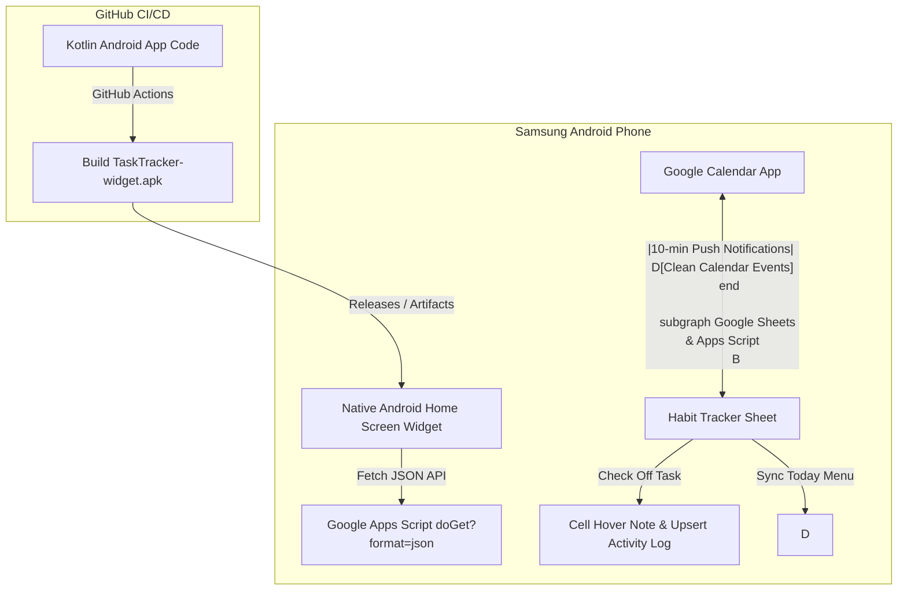

# 📊 Task Tracker & Native Samsung Android Widget with Google Calendar Sync

A powerful, automated Google Sheets task tracker and native **Samsung Android Home Screen Widget** powered by **Google Apps Script** and **Kotlin**. Features real-time completion timestamping, Google Calendar sync with phone alerts (no duplicate events, office tasks excluded), and an authentic **GitHub green contribution matrix widget** on your Samsung phone's wallpaper.

---

## 🌟 Key Features

* **📲 Native Samsung Home Screen Widget**: A true Android widget (AppWidgetProvider) styled like GitHub's contribution board (dark `#0d1117` background with 4-tier green squares) sitting right next to your apps on One UI.
* **⚡ Automated GitHub Actions CI/CD**: Cloud-compiled Android `.apk` built on every push/release. Download and install in 1 tap without needing Android Studio locally!
* **📅 Clean Google Calendar Sync**: Automatically cleans out old habit events to guarantee **zero duplicates**, filters out any "Office" tasks, and triggers mobile reminders 10 minutes before each habit.
* **🟩 GitHub-Style Contribution Heatmap**: Authentic green squares with 4 intensity levels indicating daily completion (0%, 33%, 67%, 100%).
* **🔥 Active Streak Tracker**: Live counter displaying your active consecutive streak of fully completed days.
* **📅 30-Day Matrix in Google Sheets**: Tasks listed in rows (`Gate (4 hours)`, `Leetcode (2 que)`, `Github commit (5)`) with date columns for the next 30 days.
* **📍 Today Indicator**: Today's active column is automatically highlighted in vibrant blue with a location pin (`📍`).
* **⏱️ Instant Timestamping & Upsert**: Attaches a hover note with the exact completion timestamp (`YYYY-MM-DD HH:MM:SS`) to that cell and logs the latest check time in an `Activity Log` sheet.

---

## 🏗️ Architecture

---

## 📁 Repository Contents

| Path | Description |
| :--- | :--- |
| [`Code.js`](./Code.js) | Full Google Apps Script code for Google Sheets, triggers, Calendar API, and JSON endpoints. |
| [`android/`](./android) | Native Android Kotlin project with `TaskTrackerWidgetProvider` and GitHub dark theme layout. |
| [`.github/workflows/build-apk.yml`](./.github/workflows/build-apk.yml) | GitHub Actions CI/CD pipeline that compiles the `.apk` in the cloud. |
| [`INSTRUCTIONS.md`](./INSTRUCTIONS.md) | Complete step-by-step setup, deployment, APK installation, and widget placement guide. |
| [`README.md`](./README.md) | Project overview, architecture, and feature documentation. |

---

## 🚀 Quick Setup
1. In Google Sheets, paste [`Code.js`](./Code.js) into Apps Script and click **Save**.
2. Click **🚀 Habit Tracker** > **1. Re-Build / Reset Tracker Matrix**.
3. Deploy as a Web App to get your URL.
4. Download the `app-debug.apk` from GitHub Releases / Actions, install on your Samsung phone, paste your Web App URL, and add the widget to your home screen!
5. See [`INSTRUCTIONS.md`](./INSTRUCTIONS.md) for full instructions.

---

## 📝 License
This project is open-source and free to use under the MIT License.
