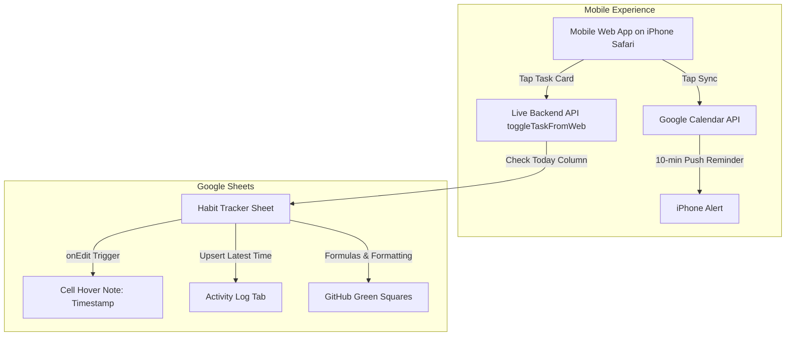

# 📊 Task Tracker & Mobile GitHub Matrix with Google Calendar Sync

A powerful, automated Google Sheets task tracker and standalone **Mobile Web App** powered by **Google Apps Script**. Features real-time completion timestamping, Google Calendar sync with phone alerts, and a true dark-mode **GitHub green dot contribution matrix** designed specifically for your phone.

---

## 🌟 Key Features

* **📱 Mobile GitHub Web App**: A mobile-optimized, dark-mode PWA (`#0d1117`) that looks and feels like GitHub. Tap tasks directly on your phone screen to check them off in real-time.
* **🟩 GitHub-Style Contribution Heatmap**: Authentic green squares with 4 intensity levels indicating daily completion (0%, 33%, 67%, 100%).
* **🔥 Active Streak Tracker**: Live counter displaying your active consecutive streak of fully completed days.
* **📅 30-Day Matrix in Google Sheets**: Tasks listed in rows (`Gate (4 hours)`, `Leetcode (2 que)`, `Github commit (5)`) with date columns for the next 30 days.
* **📍 Today Indicator**: Today's active column is automatically highlighted in vibrant blue with a location pin (`📍`).
* **⏱️ Instant Timestamping & Upsert**: Attaches a hover note with the exact completion timestamp (`YYYY-MM-DD HH:MM:SS`) to that cell and logs the latest check time in an `Activity Log` sheet.
* **🔔 Google Calendar Alerts**: Automatically schedules your habits into your Google Calendar based on target alert times (e.g., `10:00`, `18:00`, `21:30`) and delivers popup reminder notifications to your phone.

---

## 🏗️ Architecture

---

## 📁 Repository Contents

| File | Description |
| :--- | :--- |
| [`Code.js`](./Code.js) | Full Google Apps Script code for Google Sheets, triggers, Calendar API, and the Mobile Web App. |
| [`INSTRUCTIONS.md`](./INSTRUCTIONS.md) | Step-by-step setup, deployment, and iPhone home-screen instructions. |
| [`README.md`](./README.md) | Project overview, architecture, and feature documentation. |

---

## 🚀 Quick Setup
1. In Google Sheets, open **Extensions** > **Apps Script**.
2. Paste [`Code.js`](./Code.js) and click **Save**.
3. In Google Sheets, click **🚀 Habit Tracker** > **1. Re-Build / Reset Tracker Matrix**.
4. In Apps Script, click **Deploy** > **New deployment** > **Web app** -> Open the URL on your iPhone in Safari and tap **Add to Home Screen**!
5. See [`INSTRUCTIONS.md`](./INSTRUCTIONS.md) for full instructions.

---

## 📝 License
This project is open-source and free to use under the MIT License.
