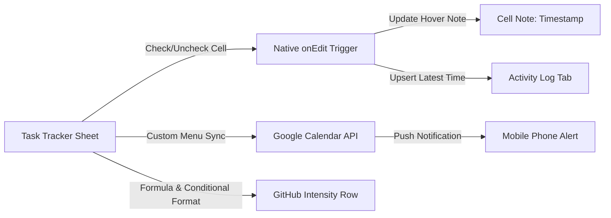

# 📊 Task Tracker & Habit Matrix with Google Calendar Sync & GitHub Heatmap

A powerful, automated Google Sheets task and habit tracking system powered by **Google Apps Script**. Features real-time completion timestamping, Google Calendar sync with mobile notifications, and GitHub-style green contribution dots to track your daily consistency.

---

## 🌟 Key Features

* **📅 Horizontal Date Matrix**: Tasks listed in rows (`Gate (4 hours)`, `Leetcode (2 que)`, `Github commit (5)`) with date columns for the next 30 days formatted as `Date Month (Day)` (e.g. `29 Sep (Tue)`).
* **📍 Today Indicator**: Today's active column is automatically highlighted in vibrant blue with a location pin (`📍`) so you never check the wrong day.
* **⏱️ Instant Timestamping**: Checking a box immediately attaches a hover note with the exact completion timestamp (`YYYY-MM-DD HH:MM:SS`) directly to that cell.
* **🔄 Smart Upsert (Latest Timestamp Only)**: Checking, unchecking, and re-checking multiple times will **only keep the latest completion time**, keeping your `Activity Log` completely clean of duplicate entries.
* **🔔 Google Calendar Alerts**: Automatically schedules your habits into your Google Calendar based on your specified target alert time (e.g., `10:00`, `18:00`, `21:30`) and delivers popup reminder notifications to your phone.
* **🟩 GitHub-Style Contribution Heatmap**: Visual intensity indicator styled exactly like GitHub's contribution matrix:
  * ⬜ Level 0 (0% - 0 tasks done): `#ebedf0`
  * 🟩 Level 1 (33% - 1 task done): `#9be9a8`
  * 🟩 Level 2 (67% - 2 tasks done): `#40c463`
  * 🟩 Level 3 (100% - 3 tasks done): `#216e39`

---

## 🏗️ Architecture

---

## 📁 Repository Contents

| File | Description |
| :--- | :--- |
| [`Code.js`](./Code.js) | Full Google Apps Script code for Google Sheets, triggers, and Calendar integration. |
| [`INSTRUCTIONS.md`](./INSTRUCTIONS.md) | Step-by-step installation, authorization, and configuration guide. |
| [`README.md`](./README.md) | Project overview, architecture, and feature documentation. |

---

## 🚀 Quick Start

1. Open your Google Sheet.
2. Go to **Extensions** > **Apps Script**.
3. Paste the contents of [`Code.js`](./Code.js) and click **Save**.
4. Refresh your Google Sheet and click **🚀 Habit Tracker** > **1. Re-Build / Reset Tracker Matrix**.
5. Read [`INSTRUCTIONS.md`](./INSTRUCTIONS.md) for full setup instructions.

---

## 📝 License
This project is open-source and free to use under the MIT License.
